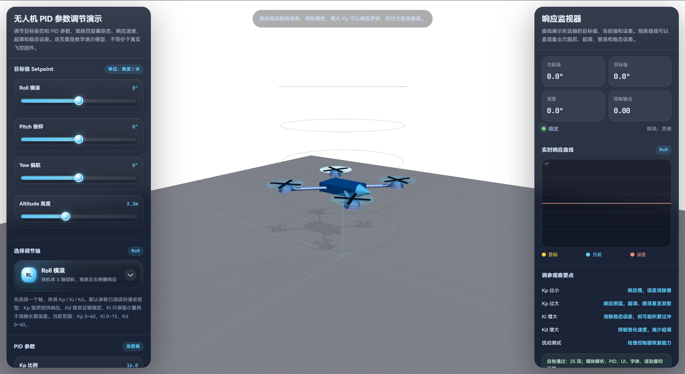

# 无人机 PID 调参模拟器

一个基于 **Three.js** 的交互式无人机 PID 参数调节模拟器，用于直观演示 `Kp`、`Ki`、`Kd` 参数对无人机姿态与高度响应的影响。

界面包含三维四旋翼模型、PID 参数滑条、目标值设置、扰动测试以及实时响应曲线，适合用于 PID 控制原理学习、无人机调参演示.

## 界面预览



## 主要功能

- Three.js 四旋翼无人机三维展示
- Roll / Pitch / Yaw / Altitude 多轴调节
- Kp / Ki / Kd 参数实时调整
- 目标值、当前值、误差和控制输出监视
- 实时响应曲线显示
- 扰动测试与阵风模拟

## 运行方法

### 方式一：直接打开

将项目中的 HTML 文件保存为：

```text
drone_pid_threejs_demo.html
```

然后使用现代浏览器打开即可。

推荐使用：

- Chrome
- Edge
- Firefox

> 注意：页面通过 CDN 加载 Three.js，因此需要联网环境。

### 方式二：使用本地服务器

如果直接打开 HTML 时浏览器限制了 ES Module 或 Import Map，可以使用本地服务器运行。

在项目目录下执行：

```bash
python -m http.server 8000
```

然后在浏览器访问：

```text
http://localhost:8000/drone_pid_threejs_demo.html
```

## 说明

该项目是教学演示模拟器，主要用于展示 PID 参数变化对系统响应的影响，并不等同于真实无人机动力学模型，不能直接用于真实飞控调参。

